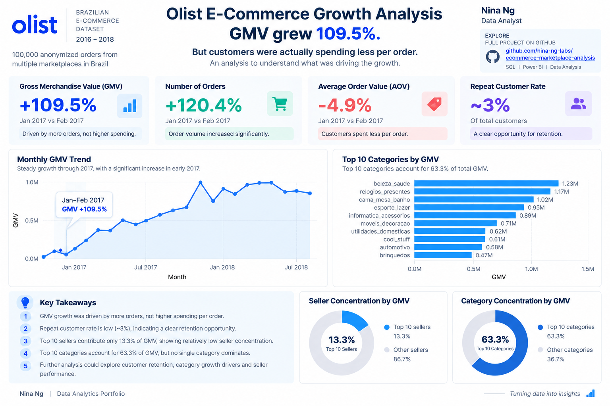

# Ecommerce Marketplace Analysis

SQL and Power BI analysis of the Brazilian Olist ecommerce marketplace, focusing on GMV trends, category and seller performance, customer retention, and the key drivers behind marketplace growth.

## Project Overview

This project analyzes the Olist ecommerce marketplace to understand business performance and identify the main drivers behind GMV growth.

The analysis follows a business investigation approach:

**GMV → Orders & AOV → Customers → Categories → Sellers**

SQL was used for data exploration, KPI calculation, contribution analysis, and driver decomposition. Power BI was used to visualize key marketplace trends.

## Dashboard



The dashboard highlights:
- Monthly GMV trend
- Top 10 product categories by GMV

## Business Questions

1. How does GMV change over time?
2. Which product categories contribute the most GMV?
3. Which sellers generate the most GMV?
4. What percentage of customers place repeat orders?
5. What are the main drivers behind GMV growth?

## Data Model

The analysis uses the main Olist marketplace entities:

- Customers
- Orders
- Order Items
- Products
- Sellers
- Payments

Core relationships:

```text
Customers
    │
    └── Orders
          │
          ├── Order Items ── Products
          │       │
          │       └── Sellers
          │
          └── Payments
```

`customer_unique_id` is used for customer-level analysis because a customer may have multiple order-level customer IDs.

## SQL Analysis

### 1. Monthly GMV

Monthly GMV was calculated from delivered orders to analyze marketplace performance over time.

### 2. Category Contribution

Product categories were ranked by GMV to identify the categories contributing most to marketplace sales.

### 3. Seller Performance

Seller GMV was analyzed to determine whether marketplace revenue is concentrated among a small number of sellers.

### 4. Repeat Customer Rate

Customers were grouped using `customer_unique_id` to identify customers who placed more than one delivered order.

### 5. GMV Driver Decomposition

GMV was decomposed into two primary components:

```text
GMV = Orders × Average Order Value
```

This allows GMV changes to be investigated through changes in order volume and AOV.

## Key Findings

- GMV increased substantially as the marketplace scaled through 2017 and 2018.
- In the January–February 2017 investigation period, **GMV increased by approximately 109.5%**.
- **Order volume increased by approximately 120.4%**, making it the primary driver of GMV growth.
- **AOV decreased by approximately 4.9%**, meaning higher order volume offset the decline in average order value.
- Only around **3% of customers were repeat customers**, indicating strong reliance on first-time customers.
- The **top 10 product categories contribute approximately 63.27% of GMV**, while the largest category contributes only **9.45%**.
- The **top 10 sellers contribute approximately 13.29% of GMV**, with the largest seller contributing only **1.72%**.
- GMV is therefore diversified across categories and particularly distributed across the seller base, with no single category or seller dominating marketplace sales.

## Business Investigation Tree

```text
GMV Growth
│
├── Orders ↑
│   │
│   └── Customers
│       ├── New Customers
│       └── Repeat Customers ≈ 3%
│
├── AOV ↓
│   └── Not the primary growth driver
│
├── Category Mix
│   ├── Top Category = 9.45%
│   └── Top 10 Categories = 63.27%
│
└── Seller Mix
    ├── Top Seller = 1.72%
    └── Top 10 Sellers = 13.29%
```

The investigation suggests that **order volume was the primary driver of GMV growth**, while customer retention represents an important opportunity for more sustainable marketplace growth.

## Business Recommendations

- Improve customer retention and encourage first-time buyers to place additional orders.
- Monitor both order volume and AOV when evaluating GMV growth.
- Track category contribution over time to identify emerging growth categories.
- Maintain a diversified seller base and monitor seller concentration as the marketplace grows.

## Repository Structure

```text
ecommerce-marketplace-analysis/
│
├── README.md
│
├── charts/
│   └── ecommerce_marketplace_analysis.png
│
├── dashboard/
│   └── ecommerce_marketplace_analysis.pbix
│
├── data_model/
│   ├── data-modeling-notes.md
│   └── schema_diagram.png
│
├── dataset/
│   └── dataset_link.txt
│
├── sql/
│   ├── category_gmv.sql
│   ├── gmv_by_month.sql
│   ├── gmv_driver_decomposition.sql
│   ├── repeat_customer_rate.sql
│   └── seller_revenue.sql
│
└── LICENSE
```

## Tools

- **PostgreSQL** — data analysis and KPI calculation
- **DataGrip** — SQL development
- **Power BI** — data visualization
- **Git & GitHub** — version control and project documentation

## Dataset

**Olist Brazilian E-Commerce Public Dataset**

Source: Kaggle  
Dataset: Brazilian E-Commerce Public Dataset by Olist

https://www.kaggle.com/datasets/olistbr/brazilian-ecommerce

The raw dataset is not included in this repository.

## Skills Demonstrated

- SQL joins and aggregations
- CTEs and window functions
- Ecommerce KPI analysis
- Period-over-period analysis
- Contribution analysis
- Customer retention analysis
- Driver decomposition
- Business investigation
- Data modeling
- Power BI visualization

## Key Business Insight

> Olist's GMV growth was driven primarily by increasing order volume rather than higher order value. However, with only around 3% repeat customers, improving customer retention represents a significant opportunity to build more sustainable marketplace growth.
